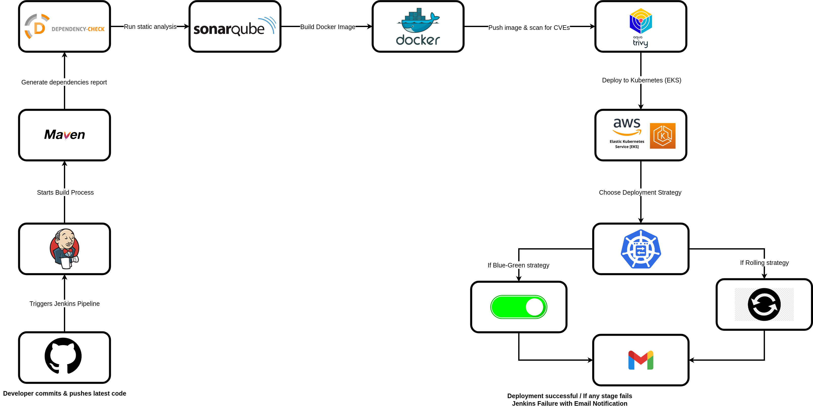
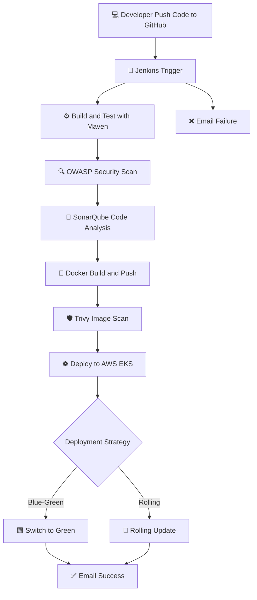
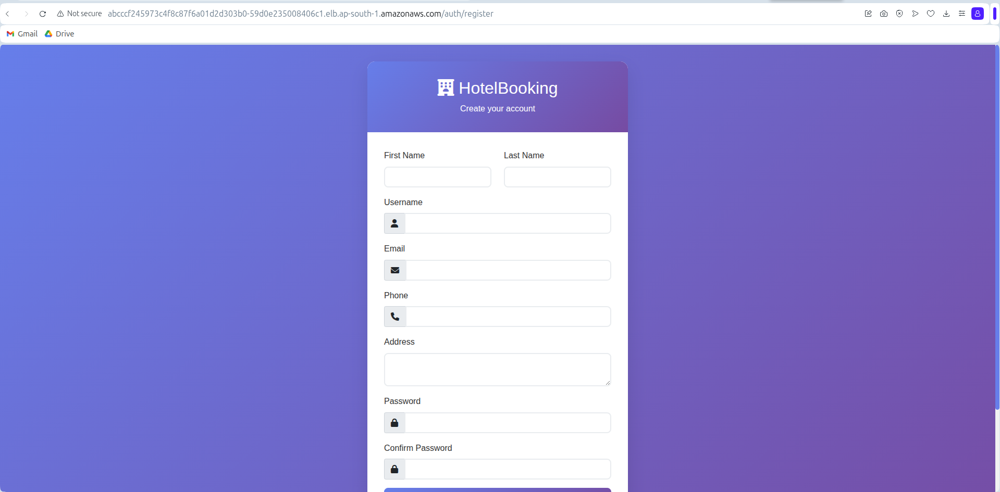
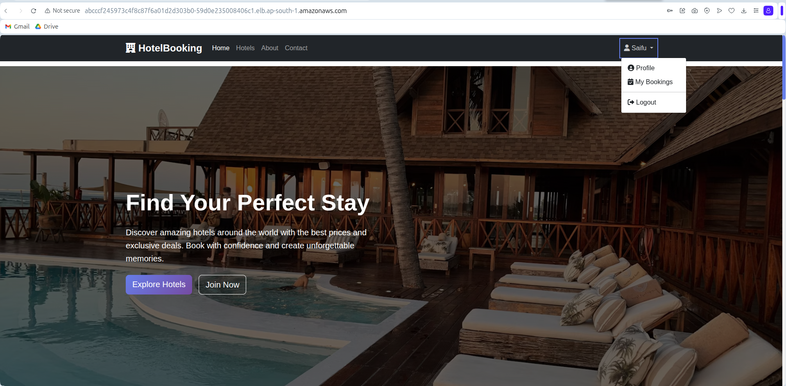
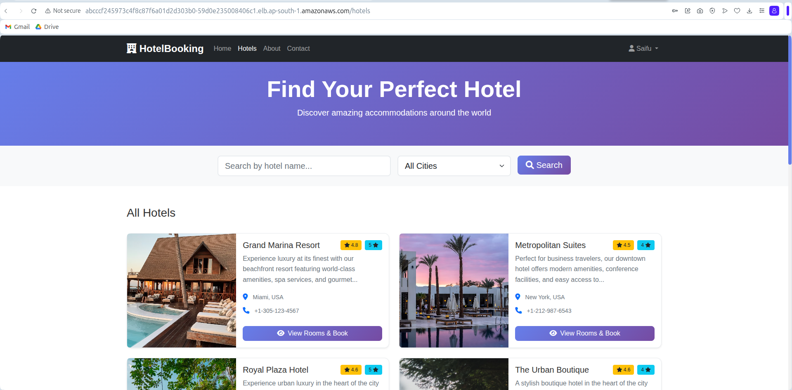

# 🏨 Luxstay Hotel Booking System — CI/CD DevSecOps Pipeline

A **fully automated CI/CD pipeline** built using **Jenkins Declarative Pipeline** for the **Hotel Booking System (Spring Boot + Maven)** project.  
It integrates **SonarQube**, **OWASP Dependency Check**, **Trivy**, **Docker**, and **AWS EKS (Kubernetes)** for **secure, zero-downtime deployment**.

---

## 🚀 **Pipeline Overview**



---

<details>
<summary>💻 Emoji-Rich Diagram (for VS Code Preview)</summary>


</details>

---

## 🧩 **Tech Stack**

| Category | Tools & Services |
|-----------|------------------|
| **CI/CD Orchestrator** | Jenkins Declarative Pipeline |
| **Build Tool** | Maven 3 |
| **Language Runtime** | OpenJDK 17 |
| **Static Analysis** | SonarQube |
| **Vulnerability Scan** | OWASP Dependency-Check, Trivy |
| **Containerization** | Docker |
| **Container Registry** | Docker Hub (`saifudheenpv`) |
| **Cloud Platform** | AWS EKS (Elastic Kubernetes Service) |
| **IaC (K8s)** | YAML manifests (`k8s/*.yaml`) |
| **Notifications** | Email via Jenkins `emailext` plugin |

---

## 🧱 **Pipeline Architecture**

### 🔧 1. Environment Setup
Verifies Java, Maven, Docker, and Kubectl versions before proceeding.

### 📦 2. Checkout Code
Pulls the latest source code from GitHub using Jenkins `scm`.

### ⚙️ 3. Auto-Migrate to Jakarta
Automatically updates Java imports:
```
javax.persistence → jakarta.persistence
```
Enabled with the parameter `AUTO_MIGRATE_JAKARTA = true`.

### 🧪 4. Build & Test
Runs Maven build and unit tests:
```bash
mvn clean test -Dspring.profiles.active=test
```

### 🔒 5. OWASP Security Scan
Scans dependencies for vulnerabilities:
```bash
mvn org.owasp:dependency-check-maven:check -DfailBuildOnCVSS=11
```
Build continues even if the scan fails (to not block deployment).

### 🧠 6. SonarQube Analysis
Performs static code analysis and sends results to SonarQube:
```
http://13.203.26.99:9000
```
Uses credentials ID `sonar-token`.

### 🐳 7. Docker Build & Push
Builds a Docker image and pushes it to Docker Hub:
```bash
docker build -t saifudheenpv/hotel-booking-system:${BUILD_ID} .
docker push saifudheenpv/hotel-booking-system:${BUILD_ID}
```

### 🛡️ 8. Trivy Image Scan
Scans Docker images for vulnerabilities:
```bash
trivy image --exit-code 0 --severity HIGH,CRITICAL saifudheenpv/hotel-booking-system:${BUILD_ID}
```

### ☸️ 9. Deploy to AWS EKS
Applies all Kubernetes manifests:
```bash
kubectl apply -f k8s/mysql-deployment.yaml
kubectl apply -f k8s/app-deployment-blue.yaml
kubectl apply -f k8s/app-deployment-green.yaml
kubectl apply -f k8s/app-service.yaml
```

### 🔁 10. Blue-Green Switch
Zero-downtime release:
```bash
kubectl patch service hotel-booking-service -p '{"spec":{"selector":{"version":"green"}}}'
```

### 📧 11. Notifications
- **Success:** Email includes live app URL and version  
- **Failure:** Email includes Jenkins console log link

---

## ⚙️ **Pipeline Parameters**

| Parameter | Type | Default | Description |
|------------|------|----------|--------------|
| `DEPLOYMENT_STRATEGY` | Choice | `blue-green` / `rolling` | Deployment type |
| `AUTO_SWITCH` | Boolean | `true` | Automatically switch traffic after deploy |
| `AUTO_MIGRATE_JAKARTA` | Boolean | `false` | Migrate `javax` → `jakarta` imports |

---

## 🌍 **Environment Variables**

| Variable | Description |
|-----------|--------------|
| `SONARQUBE_URL` | SonarQube server IP |
| `DOCKER_NAMESPACE` | Docker Hub username |
| `APP_NAME` | Application name |
| `APP_VERSION` | Jenkins build version |
| `K8S_NAMESPACE` | Kubernetes namespace |
| `REGION` | AWS region (e.g. `ap-south-1`) |
| `CLUSTER_NAME` | EKS cluster name |
| `EXTERNAL_IP` | Service load balancer IP |

---

## 📤 **Email Notifications**

### ✅ **Success**
**Subject:**  
```
✅ LIVE: Luxstay Hotel v${APP_VERSION}
```

**Body:**  
- App Version  
- Public URL  
- Jenkins Build Link  

---

### ❌ **Failure**
**Subject:**  
```
❌ FAILED: Luxstay Hotel v${APP_VERSION}
```

**Body:**  
- Error message  
- Link to console logs  

---

## 🧭 **Pipeline Flow Summary**

1. Developer pushes code to GitHub  
2. Jenkins triggers build automatically  
3. Code built, tested, and scanned  
4. SonarQube + OWASP + Trivy ensure quality and security  
5. Docker image pushed to Docker Hub  
6. Deployment to AWS EKS  
7. Blue-Green or Rolling strategy applied  
8. Email sent upon success/failure  

---

## 🧠 **Best Practices**

✅ Parameterize your builds  
✅ Store all credentials in Jenkins Credential Store  
✅ Use GitHub Webhooks for auto-trigger  
✅ Rotate API keys regularly  
✅ Implement Quality Gates in SonarQube  

---

## Website Screenshots

### Home Page


### Register User


### Login User


### Profile Page


### Browse Hotels


---

## 🏁 **Expected Result**

After a successful build:
- ✅ Docker image pushed → `docker.io/saifudheenpv/hotel-booking-system:BUILD_ID`
- ✅ Application deployed to AWS EKS
- ✅ Email notification sent with live app URL

---

## 💡 **Future Enhancements**

- 🔐 Integrate HashiCorp Vault for secret management  
- 📊 Add Prometheus & Grafana for monitoring  
- 🧠 Use AI/ML-based anomaly detection for DevSecOps  

---

## 👨‍💻 **Author**

**Saifudheen PV**  
🌍 DevOps & Cloud Engineer 
📧 [mesaifudheenpv@gmail.com](mailto:mesaifudheenpv@gmail.com)

---

⭐ *If you find this pipeline useful, please give it a star on GitHub!*