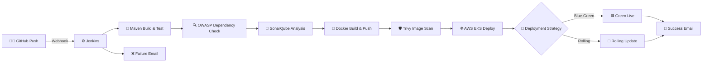

# 🏨 LuxStay – Hotel Booking System

## 🚀 Enterprise-Grade CI/CD DevSecOps Pipeline

<p align="center">
  
</p>

<p align="center">
  
  
  
  
  
</p>

<p align="center">
  <b>Production-ready | Secure | Zero-Downtime | Fully Automated</b>
</p>

---

## 🎬 Animated CI/CD Pipeline Flow

<p align="center">
  
</p>

> 🔥 *GIF-based animation for GitHub + Mermaid for VS Code preview*



---

## 🧩 Tech Stack

| Category      | Tools                         |
| ------------- | ----------------------------- |
| CI/CD         | Jenkins Declarative Pipeline  |
| Build         | Maven 3                       |
| Runtime       | OpenJDK 17                    |
| Code Quality  | SonarQube                     |
| Security      | OWASP Dependency Check, Trivy |
| Container     | Docker                        |
| Registry      | Docker Hub (saifudheenpv)     |
| Orchestration | Kubernetes (AWS EKS)          |
| Notifications | Jenkins Email Extension       |

---

## 🏗️ Pipeline Stages (Step-by-Step)

### 1️⃣ Environment Validation

* Java
* Maven
* Docker
* kubectl

### 2️⃣ Source Code Checkout

* Pulls latest code from GitHub SCM

### 3️⃣ Jakarta Auto-Migration (Optional)

```bash
javax.persistence → jakarta.persistence
```

### 4️⃣ Build & Test

```bash
mvn clean test -Dspring.profiles.active=test
```

### 5️⃣ OWASP Dependency Scan

```bash
mvn org.owasp:dependency-check-maven:check -DfailBuildOnCVSS=11
```

### 6️⃣ SonarQube Static Analysis

* Code smells
* Bugs
* Security hotspots

### 7️⃣ Docker Build & Push

```bash
docker build -t saifudheenpv/hotel-booking-system:${BUILD_ID} .
docker push saifudheenpv/hotel-booking-system:${BUILD_ID}
```

### 8️⃣ Trivy Image Scan

```bash
trivy image --severity HIGH,CRITICAL saifudheenpv/hotel-booking-system:${BUILD_ID}
```

### 9️⃣ Kubernetes Deployment (EKS)

```bash
kubectl apply -f k8s/
```

### 🔁 Blue-Green Switch

```bash
kubectl patch service hotel-booking-service -p '{"spec":{"selector":{"version":"green"}}}'
```

---

## ⚙️ Jenkins Parameters

| Name                 | Type    | Description          |
| -------------------- | ------- | -------------------- |
| DEPLOYMENT_STRATEGY  | Choice  | blue-green / rolling |
| AUTO_SWITCH          | Boolean | Auto traffic switch  |
| AUTO_MIGRATE_JAKARTA | Boolean | javax → jakarta      |

---

## 🌍 Environment Variables

| Variable         | Description      |
| ---------------- | ---------------- |
| SONARQUBE_URL    | Sonar server     |
| DOCKER_NAMESPACE | Docker Hub user  |
| APP_NAME         | Application name |
| APP_VERSION      | Build ID         |
| CLUSTER_NAME     | EKS Cluster      |
| REGION           | AWS Region       |

---

## 📧 Email Notifications

### ✅ Success

* Live Application URL
* Version
* Jenkins Build Link

### ❌ Failure

* Error Summary
* Console Logs

---

## 🧠 DevSecOps Best Practices

✅ Shift-left security
✅ Credential vaulting
✅ Parameterized pipelines
✅ Zero-downtime deployments
✅ Continuous quality gates

---

## 🚀 Future Enhancements

* 🔐 HashiCorp Vault
* 📊 Prometheus & Grafana
* 🤖 AI-based anomaly detection

---

## 👨‍💻 Author

**Saifudheen PV**
DevOps & Cloud Engineer
📧 [mesaifudheenpv@gmail.com](mailto:mesaifudheenpv@gmail.com)

---

⭐ *Star this repository if you find it useful!*
